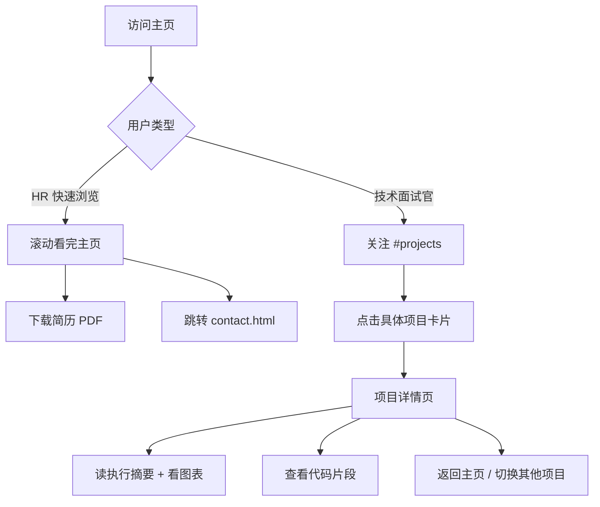

# 数据分析师个人作品集网站 PRD文档 v3.0

**版本：** v3.0（与 2026-05 实际实现对齐版）
**最初日期：** 2025年1月
**重写日期：** 2026年5月
**作者：** Juye Xiao + Claude Code
**说明：** 本版本删除了 v2.x 中虚构的运行时数据层（`data.js` / `ContentRenderer` / `Plotly` 动态渲染），并按当前已部署的真实静态站点结构重写 §3 信息架构、§4 功能需求、§6 技术架构、§8 开发计划、§9 测试、§12 成功标准。

---

## 1. 产品概述

### 1.1 产品背景
作为数据分析师，需要一个专业的在线作品集网站来展示个人的专业能力、项目经验和技术实力。HR 需要快速浏览候选人概况，技术面试官需要深入了解项目细节。因此采用混合架构，既满足快速浏览需求，又能展示项目深度。

### 1.2 产品定位
一个采用"主页概览 + 项目详情"混合架构的数据分析师作品集网站。主页是一份单页滚动式简历＋作品集概览，项目独立成详情页深度展示分析过程、可视化与代码。

### 1.3 目标用户

| 用户类型 | 需求特点 | 使用场景 |
|---------|---------|---------|
| **HR / 招聘者** | 快速了解候选人背景 | 30 秒 - 2 分钟快速浏览 |
| **技术面试官** | 深入评估技术能力 | 5 - 15 分钟详细查看项目 |
| **部门主管** | 了解业务影响力 | 3 - 5 分钟查看项目成果 |
| **猎头** | 获取基本信息和联系方式 | 1 - 2 分钟获取关键信息 |

### 1.4 核心价值
- **双层展示体系**：主页快速概览 + 详情页深度展示
- **专业数据展示**：分析图表 + 代码能力展示
- **灵活访问路径**：支持快速浏览和深度探索两种模式
- **项目可分享性**：每个项目有独立 URL，便于定向分享
- **米色设计系统**：温暖、克制、有人文感的视觉语言（Data Poetics）

---

## 2. 产品目标与成功指标

### 2.1 产品目标

| 阶段 | 目标 | 关键结果 |
|------|------|---------|
| **短期** | 网站上线、对外可分享 | - 5 个核心页面（主页 + 3 个项目详情页 + 联系页）<br>- GitHub Pages 部署 |
| **中期** | 在求职 / Networking 场景中产生价值 | - 至少 5 次面试邀请<br>- 项目页平均停留时间 > 3 分钟 |
| **长期** | 建立个人品牌沉淀 | - 月均访问 100+<br>- 持续更新机制<br>- 形成可复用的作品集模板 |

### 2.2 成功指标

| 指标类型 | 具体指标 | 目标值 |
|---------|---------|--------|
| **性能** | 主页加载时间 | < 2s |
| | 项目详情页加载时间 | < 3s |
| | 交互响应 | < 100ms |
| | Lighthouse 综合分 | > 90 |
| **用户体验** | 主页停留时间 | > 1 分钟 |
| | 项目详情页停留时间 | > 3 分钟 |
| | 跳出率 | < 40% |
| **转化** | 简历下载率 | > 15% |
| | 项目详情点击率 | > 30% |
| | 联系转化率 | > 5% |

---

## 3. 信息架构

### 3.1 站点结构（2026-05 实际实现）

```
portfolio/
│
├── 主页 index.html / index-en.html  ── 单页滚动式
│   ├── 导航栏（固定，半透明背景 + backdrop-filter 模糊）
│   │   ├── Logo（"Data Weaver" SVG 动画）
│   │   ├── 页内锚点（关于 / 经历 / 教育 / 项目 / 技能 / 联系）
│   │   ├── 语言切换按钮（#lang-toggle，中⇄EN）
│   │   └── 主题切换按钮（深 / 浅）
│   │
│   ├── #hero ── 通栏氛围 Hero
│   │   ├── 背景：assets/img/hero/atmosphere-bg.jpg + 双层 veil
│   │   ├── 左栏（~7/12）：姓名、职位、一句话介绍、主 CTA（简历 / 联系）
│   │   └── 右栏（~5/12）：.now-card "当前状态"
│   │        现居 / 在做 / 在读 / 邮箱
│   │
│   ├── #about ── 杂志式 About（5/7 分栏）
│   │   ├── 左栏（5/12，桌面端）：assets/img/about-portrait.jpg
│   │   └── 右栏（7/12）：个人简介 + 核心定位文案
│   │
│   ├── #experience ── 工作经历（3/9 分栏）
│   │   └── 时间标签（3/12）+ 公司/职位/成就（9/12），多条堆叠
│   │
│   ├── #education ── 教育背景（3/9 分栏）
│   │   └── 同上结构：学校时间 + 学位/方向/奖项
│   │
│   ├── #projects ── 项目展示（Bento Grid）
│   │   └── 项目卡片：标题、一句话摘要、技术标签、关键指标、"查看详情"链接
│   │       链接指向 projects/<name>/<name>.html
│   │
│   ├── #skills ── 技能矩阵
│   │   └── 技术 / 工具 / 软技能分组卡片
│   │
│   └── 页脚 ── 联系入口（跳转 contact.html）
│
├── 联系页 contact.html / contact-en.html
│   ├── 联系方式（邮箱 / LinkedIn / GitHub）
│   └── 联系表单（mailto 集成）
│
└── 项目详情页 projects/<name>/<name>.html / <name>-en.html
    ├── 返回主页导航
    ├── 项目标题 + 一句话价值主张
    ├── 执行摘要（背景 / 方案 / 影响）
    ├── 数据概览
    ├── 方法论 / 建模流程
    ├── 关键代码片段（Prism.js 高亮）
    ├── 静态可视化图表（PNG 序列，存于 figures/）
    ├── 结果与业务影响
    └── 阅读进度条 + 滚动渐现
```

### 3.2 当前三个项目页

| 项目名 | 文件夹 | 图表数 |
|---|---|---|
| 银行客户流失预测 | `projects/Bank Customer Churn Prediction/` | 5 |
| 电商欺诈检测 | `projects/e-commerce fraud detection/` | 8 |
| 贷款违约预测 | `projects/lending hub loan prediction/` | 15 |

### 3.3 页面流程



---

## 4. 功能需求

### 4.1 主页功能模块

#### P0 - 核心功能（已实现）

| 功能模块 | 描述 | 验收标准 |
|---|---|---|
| **固定导航栏** | 滚动时保持可见，半透明 + 模糊 | 各分辨率正常吸顶 |
| **Hero 区** | 左栏自我介绍 + 右栏 Now 信息卡 + 通栏氛围背景图 | 信息完整，深浅模式下都有视觉冲击 |
| **About 区** | 杂志式 5/7 分栏（左肖像 + 右文案） | 移动端单列堆叠，桌面端 portrait 显示 |
| **工作经历时间轴** | 3/9 分栏 + 多条目堆叠 | 时间线清晰、可滚动阅读 |
| **教育背景** | 3/9 分栏 | 与经历区视觉对齐 |
| **项目 Bento 网格** | 主页展示 3 个核心项目 | 卡片悬停效果，点击跳转详情页 |
| **技能矩阵** | 技术 / 工具 / 软技能分组卡片 | 清晰展示熟练度 |
| **简历下载入口** | 中英文 PDF | ⚠ 当前 Hero CTA `href="#"` 仍未连线，待修复 |
| **响应式布局** | 适配手机 / 平板 / 桌面 | 各设备显示正常，无横向滚动 |

#### P1 - 增强功能

| 功能模块 | 描述 | 状态 |
|---|---|---|
| **深 / 浅主题切换** | 点击 toggle，写入 `localStorage.theme`，类切换 `html.dark` | ✅ 已实现 |
| **中英语言切换** | URL 路由式（`-en.html` 镜像），偏好持久化到 `localStorage.language`，自动重写内部链接 | ✅ 已实现 |
| **Logo "Data Weaver" 动画** | 网格线 → 织梭 → JX 字母三段式 | ✅ 已实现 |
| **滚动渐现** | `.reveal` 类 + IntersectionObserver | ✅ 已实现 |
| **数字计数动画** | Hero 区指标进入视口后从 0 计数到目标值 | ⚠ 当前 Hero 已改为 Now 信息卡，数字计数功能仍保留但未在主 Hero 使用 |
| **导航 Scroll Spy** | 滚动到对应区块时高亮对应导航项 | ✅ 已实现 |

### 4.2 语言切换系统（当前实现）

**实现方式：URL 路由 + localStorage，无运行时 i18n。**

| 功能点 | 实现 |
|---|---|
| 语言版本区分 | 每个页面提供 `foo.html`（默认 zh-CN）和 `foo-en.html`（en）两份手写副本 |
| 切换按钮 | `#lang-toggle` 显示对面语种文案（中文页显示 `EN`，英文页显示 `中`） |
| 偏好存储 | 点击切换时写入 `localStorage.language`，值为 `'zh'` 或 `'en'` |
| 自动重定向 | 页面加载时如果 `localStorage.language` 与当前 URL 不一致，跳转到对应语种页面 |
| 链接重写 | `language-switcher.js` 自动重写导航链接、项目卡片链接、Logo 链接、联系按钮 `href`，使内部跳转保持当前语种 |
| 浏览器语言检测 | **不实现**。首次访问默认中文，由用户主动切换 |
| 翻译数据 | **不存在统一翻译表**。中英内容分别硬编码在两份 HTML 文件中，需要同步手动维护 |

> v2.x PRD 中描述的 `data.js` / `ContentRenderer` / `i18n.js` 运行时翻译方案**未采用**，已从架构中删除。

### 4.3 项目详情页功能模块

#### P0 - 核心功能（已实现）

| 功能模块 | 描述 | 实现 |
|---|---|---|
| **返回导航** | 顶部固定，回到主页对应锚点 | ✅ |
| **项目封面 + 摘要** | 标题、一句话价值、关键指标 | ✅ |
| **业务背景** | 结构化文本 | ✅ |
| **数据概览** | 表格 + 静态图 | ✅ |
| **方法论展示** | 流程文字 + 静态流程图 PNG | ✅ |
| **静态可视化图表** | 项目目录 `figures/` 下的 PNG 序列 | ✅ |
| **代码展示** | Prism.js 高亮 | ✅ |
| **结果与影响** | 量化数据 | ✅ |
| **阅读进度条** | `initScrollProgress()` 顶部细条 | ✅ |
| **预估阅读时间** | `initReadingTime()` 头部展示 | ✅ |
| **图片点击放大** | `.figure-editorial img` 缩放预览 | ✅ |

#### P1 - 增强功能

| 功能模块 | 描述 | 状态 |
|---|---|---|
| **侧边目录导航** | 长页面快速跳转 | ⚠ 部分实现 |
| **代码可复制** | 一键复制按钮 | ⚠ 待实现 |
| **图表交互化（Plotly.js）** | 替换部分静态 PNG 为交互图 | ❌ 未实现，`charts.js` 仅为脚手架 |
| **相关项目推荐** | 底部跳转其他项目 | ❌ 未实现 |

### 4.4 数据策略

**当前方案：所有页面内容直接硬编码在 HTML 中**，无运行时数据层。

- 中文内容写在 `foo.html`，英文写在 `foo-en.html`，两份手动同步
- 没有 `data.js`，没有 `ContentRenderer`，没有 `assets/data/` 数据目录
- 修改个人信息 / 工作经历 / 项目卡片时，按 §3 列出的页面位置直接改 HTML
- 这种"双副本静态"方案的代价是翻译需手动同步；收益是零运行时依赖、SEO 友好、GitHub Pages 直接托管

未来若引入 CMS 或多语言扩展，可考虑迁移到 11ty / Astro 等静态生成器，但这不是当前 v3.0 范围。

---

## 5. 非功能需求

### 5.1 性能需求

| 页面类型 | 性能指标 | 目标值 | 优化策略 |
|---------|---------|--------|---------|
| **主页** | 首屏加载 | < 2s | 图片懒加载、Google Fonts preconnect |
| | 完整加载 | < 4s | 资源压缩、CDN |
| **项目详情页** | 首屏加载 | < 2.5s | PNG 图表懒加载 |
| | 交互响应 | < 100ms | 节流 / 防抖 |
| **通用** | Lighthouse 综合分 | > 90 | 持续监控 |

### 5.2 兼容性需求

| 类型 | 要求 |
|------|------|
| **浏览器** | 最近 2 个版本：Chrome / Firefox / Safari / Edge |
| **设备** | Desktop（1920 / 1440 / 1366）、Tablet（768 / 1024）、Mobile（375 / 414） |
| **网络** | 4G 可用，3G 降级可访问 |

### 5.3 SEO 需求

| 页面 | 要求 | 实现 |
|------|------|------|
| **主页** | 完整 meta（title / description / keywords） | ✅ |
| **项目详情页** | 独立 SEO 信息 | ✅ |
| **通用** | JSON-LD 结构化数据（Person） | ✅ |
| | Open Graph + Twitter Card | ✅ |

---

## 6. 技术架构

### 6.1 技术栈

| 层级 | 选择 | 说明 |
|------|---------|------|
| **前端** | 纯静态 HTML5 / CSS3 / ES6+ JS | 无构建步骤 |
| **CSS 工具** | CSS Grid + Flexbox + 自定义属性 | 12 列网格、米色变量系统 |
| **Tailwind** | CDN 运行时版本 `cdn.tailwindcss.com` | ⚠ 开发期方案，生产应换静态构建 |
| **图标** | Lucide Icons（CDN） | — |
| **字体** | Google Fonts：Inter + JetBrains Mono | `--font-display: Fraunces` 已声明但未在 `<link>` 中加载（回退到 Songti SC / Georgia） |
| **代码高亮** | Prism.js（按需引入） | 项目详情页使用 |
| **图表** | 静态 PNG（项目 `figures/` 下） | `charts.js` 是 Plotly.js 集成脚手架，**未启用** |
| **动画** | CSS Animation + IntersectionObserver | 原生实现 |
| **部署** | GitHub Pages，从 `master` 分支静态托管 | 无 CI/CD 流水线 |

### 6.2 实际文件结构

```
portfolio/
├── index.html / index-en.html              # 主页（中文 + 英文镜像）
├── contact.html / contact-en.html          # 联系页
├── projects/
│   ├── _template.html                      # 项目页模板
│   ├── Bank Customer Churn Prediction/
│   │   ├── *.html / *-en.html
│   │   └── figures/                        # 5 张 PNG
│   ├── e-commerce fraud detection/
│   │   ├── *.html / *-en.html
│   │   └── figures/                        # 8 张 PNG
│   └── lending hub loan prediction/
│       ├── *.html / *-en.html
│       └── figures/                        # 15 张 PNG
├── assets/
│   ├── css/
│   │   ├── index.css                       # 主样式 + 全局变量
│   │   ├── project.css                     # 项目详情页样式
│   │   ├── contact.css                     # 联系页样式
│   │   └── README.md                       # CSS 架构说明
│   ├── js/
│   │   ├── common.js                       # 主题 / 滚动渐现 / 导航（自动初始化）
│   │   ├── index.js                        # 主页 Scroll Spy + 平滑滚动 + 数字计数
│   │   ├── contact.js                      # 联系表单
│   │   ├── project.js                      # 项目页：滚动进度、阅读时间、图片放大
│   │   ├── logo.js                         # Data Weaver Logo 动画
│   │   ├── language-switcher.js            # URL 路由式中英切换
│   │   └── charts.js                       # Plotly 脚手架（未启用）
│   └── img/
│       ├── about-portrait.jpg              # About 区肖像
│       └── hero/atmosphere-bg.jpg          # Hero 通栏氛围背景
├── test-common.html                         # common.js 手动测试页
├── demo-editorial-hero.html                 # Hero 设计探索 demo
├── 肖炬晔简历.pdf                          # 中文简历
├── Juye Xiao Resume.pdf                    # 英文简历
├── README.md
├── prd需求.md                              # 本文档
└── 设计风格文档米色.md                      # 设计系统文档
```

> **不存在的文件**：v2.x PRD 列出的 `assets/js/data.js`、`content-renderer.js`、`i18n.js`、`assets/data/projects/` 目录均**未实现也不会实现**——内容直接硬编码在 HTML。

### 6.3 JavaScript 模块职责

| 模块 | 职责 |
|---|---|
| `common.js` | 基础设施：主题切换、导航滚动、Lucide 图标初始化、`.reveal` 滚动渐现 IntersectionObserver。`DOMContentLoaded` 时自动实例化 `window.commonFeatures`。每个页面都加载。 |
| `language-switcher.js` | URL 路由式中英切换。读取当前 URL 判断语种，写入 `localStorage.language`，自动重写内部链接 `href`。**不读 navigator.language**。 |
| `index.js` | 主页专属：Scroll Spy 高亮、锚点平滑滚动、数字计数动画。基于 `commonFeatures`。 |
| `contact.js` | 联系页表单：mailto 链接构建 + 客户端打开。 |
| `project.js` | 项目页专属：`initScrollReveals()` 渐现、`initScrollProgress()` 顶部进度条、`initReadingTime()` 阅读时间估算、`.figure-editorial img` 点击放大。 |
| `logo.js` | "Data Weaver" SVG 三段式动画（0-0.7s 网格 → 0.8-2.3s 织梭 → 1.8-2.8s JX）。 |
| `charts.js` | Plotly.js 集成的脚手架，**当前未启用**，所有项目页图表为静态 PNG。 |

**页面脚本加载顺序：** `logo.js` → `common.js` → 页面专属 JS → `language-switcher.js`。

### 6.4 主题系统

```javascript
// 主题检测与初始化（common.js）
if (localStorage.getItem('theme') === 'dark' ||
    (!('theme' in localStorage) && window.matchMedia('(prefers-color-scheme: dark)').matches)) {
  document.documentElement.classList.add('dark');
}
```

- 用类 `html.dark` 而非 `[data-theme="dark"]` 属性选择器
- 切换时写入 `localStorage.theme`，并 dispatch `themechange` 事件到 `window`，其他模块可监听响应

### 6.5 Logo 动画系统

```javascript
// logo.js 核心时序
setTimeout(() => this.weaverLine.classList.add('animate'), 800);   // 织梭穿梭
setTimeout(() => this.logoLetters.classList.add('animate'), 1800); // JX 显现
```

设计概念：
- **网格线**（0-0.7s）：数据结构、分析框架
- **织梭穿梭**（0.8-2.3s）：数据编织、模式识别（珊瑚色，stroke-dasharray 动画）
- **JX 显现**（1.8-2.8s）：最终形成个人标识
- 悬停时展开"Juye Xiao"全名

---

## 7. 设计规范

参见 `设计风格文档米色.md`（Design System 2.0 - 米色版）。要点：
- 95% 中性色 + 5% 强调色（Coral / Sage / Blue / Gold）
- 12 列网格 + 8px 间距音阶
- 字体：Inter（正文）/ JetBrains Mono（代码）/ Fraunces（展示，回退中）
- 暗色模式映射到墨色系（`html.dark` 类）

---

## 8. 开发计划与完成度

### 8.1 当前完成度（2026-05）

**整体完成度约 85%。剩余 15% 主要是简历下载联动、Plotly 交互图表、生产构建优化。**

#### Phase 1: 基础架构 — ✅ 已完成
- [X] 项目目录结构
- [X] 基础 HTML 模板
- [X] CSS 变量系统（米色 + 暗色）
- [X] 响应式布局框架
- [X] 主题切换基础
- [X] 联系页面
- [X] Logo "Data Weaver" 动画
- [X] CSS 模块化（index / project / contact）
- [X] JS 模块化（common / index / contact / project / logo / language-switcher）

#### Phase 2: 主页 — ✅ 已完成
- [X] Hero 区（Now 信息卡 + 通栏氛围背景，ad3bcfe 重新设计）
- [X] 导航栏 + Scroll Spy
- [X] About 区（杂志式 5/7 分栏 + portrait）
- [X] 工作经历（3/9 分栏）
- [X] 教育背景（3/9 分栏）
- [X] 项目 Bento Grid
- [X] 技能矩阵
- [X] 联系入口
- [X] 滚动渐现（IntersectionObserver）
- [X] 数字计数动画

#### Phase 3: 项目详情页 — ✅ 已完成
- [X] `_template.html` 模板
- [X] 银行客户流失预测（5 图）
- [X] 电商欺诈检测（8 图）
- [X] 贷款违约预测（15 图）
- [X] Prism.js 代码高亮
- [X] 阅读进度条 + 阅读时间估算
- [X] 项目目录系统 + 图片点击放大
- [X] 项目页样式系统（`project.css`）
- [⚠] 项目数据动态加载 — **不实现**（已确认走静态 HTML 路线）
- [❌] 交互式 Plotly 图表 — 未实现，仍用静态 PNG

#### Phase 4: 功能增强 — ✅ 多数完成
- [X] 主题切换 + 暗色模式
- [X] 滚动 / Logo / 数字计数动画
- [X] 联系表单（mailto 集成）
- [X] SEO 基础（meta + Open Graph + JSON-LD）
- [X] 中英语言切换（`language-switcher.js`，URL 路由式）
- [X] 中英两套页面镜像（主页 + 联系页 + 3 个项目页）
- [X] 智能链接重写
- [❌] 简历下载 CTA 联动 — Hero 按钮 `href="#"` 仍未连线对应语种 PDF

#### Phase 5: 部署与优化 — ⚠ 部分完成
- [X] GitHub Pages 部署（从 master 分支静态托管）
- [ ] 性能优化（WebP 转换、图片懒加载、资源压缩）
- [ ] Tailwind 生产构建（替换 CDN 运行时）
- [ ] GitHub Actions 自动化部署
- [ ] 跨浏览器深度测试
- [ ] 移动端深度优化

### 8.2 已知技术债

1. **Tailwind CDN 运行时** — `cdn.tailwindcss.com` 不适合生产，应换为预编译产出
2. **Fraunces 字体未加载** — `--font-display` 声明了 Fraunces，但 `index.html` 的 Google Fonts URL 未包含，实际回退到系统衬线字
3. **`charts.js` 脚手架** — 引入了但未使用，可保留供未来集成
4. **Hero 简历下载 CTA** — `href="#"` 占位，应根据当前语种指向 `肖炬晔简历.pdf` 或 `Juye Xiao Resume.pdf`
5. **`test-common.html` / `demo-editorial-hero.html`** — 开发期手动测试与设计探索页面，可考虑移到 `dev/` 子目录或在生产构建中排除

---

## 9. 测试

### 9.1 测试策略

**当前站点没有自动化测试基础设施**（无 Jest、无 Playwright 套件、无 CI 运行测试）。验证依赖人工浏览器测试 + Lighthouse 评分。

未来若引入测试，优先级建议：
1. Playwright e2e 测试核心用户路径（首页 → 项目页 → 联系页 + 中英切换）
2. 视觉回归（Percy / Chromatic）锁定关键页面
3. Lighthouse CI 作为性能门禁

### 9.2 手动测试清单

#### 9.2.1 语言切换
- [ ] 清空 `localStorage` 后访问 `index.html` → 显示中文
- [ ] 点击 `#lang-toggle` → 跳转 `index-en.html` → 显示英文
- [ ] `localStorage.language` 等于 `'en'`
- [ ] 刷新英文页面 → 保持英文
- [ ] 在英文主页点击项目卡片 → 进入对应项目的 `-en.html` 版本
- [ ] 项目详情页点击"返回主页" → 回到 `index-en.html` 而非 `index.html`

#### 9.2.2 主题切换
- [ ] 点击主题按钮 → `html` 元素加 / 去 `.dark` 类
- [ ] `localStorage.theme` 写入 `'dark'` 或 `'light'`
- [ ] 刷新后保留偏好
- [ ] 切换主题时其他组件（如 Lucide 图标、project 阅读进度条）颜色同步更新（通过 `themechange` 事件）

#### 9.2.3 响应式
- [ ] 桌面 1920 / 1440 / 1366：12 列网格、Hero 7/5 分栏正常
- [ ] 平板 1024 / 768：项目 Bento 切换为 2 列，导航栏正常
- [ ] 手机 414 / 375：单列堆叠、About portrait 隐藏、字号可读

#### 9.2.4 性能
- [ ] `lighthouse http://localhost:8000 --view` → 综合分 > 90
- [ ] 首次内容绘制 < 1.5s
- [ ] 可交互时间 < 3s
- [ ] 无明显布局偏移（CLS < 0.1）

#### 9.2.5 项目详情页
- [ ] 滚动顶部进度条平滑增长
- [ ] 阅读时间估算合理
- [ ] 点击图表 → 放大预览
- [ ] 代码块 Prism 高亮正常
- [ ] 中英两版内容对应一致

---

## 10. 风险管理

### 10.1 风险评估矩阵

| 风险项 | 概率 | 影响 | 等级 | 缓解措施 |
|--------|------|------|------|---------|
| **技术风险** | | | | |
| Tailwind CDN 运行时性能 | 高 | 中 | 高 | 切换到预编译构建 |
| 双副本翻译漂移（中英内容不同步） | 中 | 中 | 中 | 修改时强制两份一起改，建立 review checklist |
| 浏览器兼容性 | 中 | 中 | 中 | 充分测试 + 必要 Polyfill |
| **内容风险** | | | | |
| 项目内容陈旧 | 中 | 高 | 中 | 每季度回顾，至少更新一个 |
| 简历 PDF 未联动 CTA | 高 | 中 | 中 | 修复 Hero `href="#"` 占位 |
| **运维风险** | | | | |
| GitHub Pages 限制（仓库大小 / 流量） | 低 | 高 | 中 | 备选 Netlify / Vercel |
| 资源体积膨胀（atmosphere-bg.jpg 4.2MB） | 中 | 中 | 中 | WebP 转换、图片优化 |

### 10.2 应急预案

1. **性能急剧下降**
   - 方案 A：关闭部分动画（`.reveal`、Logo 动画）
   - 方案 B：替换大图为 WebP 或更小 JPG
   - 方案 C：启用更激进缓存

2. **GitHub Pages 出问题**
   - 方案 A：Netlify（拖拽部署即可）
   - 方案 B：Vercel
   - 方案 C：Cloudflare Pages

---

## 11. 维护计划

### 11.1 日常维护

| 维护项 | 频率 | 具体内容 |
|--------|------|---------|
| **内容更新** | 按需 | 添加新项目、更新工作经历，中英两份同步 |
| **简历更新** | 求职季按需 | 同时替换 `肖炬晔简历.pdf` 和 `Juye Xiao Resume.pdf` |
| **性能监控** | 每月 | Lighthouse 抽查；检查 console 报错 |
| **依赖更新** | 每季度 | CDN 链接版本（Tailwind / Lucide / Prism / Plotly） |
| **安全检查** | 每季度 | CSP 头是否仍有效，是否引入新外部资源 |

### 11.2 添加新项目的流程

```bash
# 1. 准备资源
#    创建 projects/<新项目名>/figures/，放入 PNG 图表
#    复制 projects/_template.html 到 projects/<新项目名>/<新项目名>.html

# 2. 翻译镜像
#    创建 projects/<新项目名>/<新项目名>-en.html，逐段翻译

# 3. 主页项目卡片
#    在 index.html 和 index-en.html 的 .bento-grid 区域各加一张卡片

# 4. 可选：language-switcher 路由
#    若希望显式路由，在 assets/js/language-switcher.js 的
#    LANGUAGES.<lang>.pages.projects 注册（一般情况下通用 -en 规则就够了）

# 5. 本地测试
python -m http.server 8000
#    访问 http://localhost:8000/，验证：响应式、深浅模式、语言切换、卡片跳转、详情页阅读

# 6. 提交
git add projects/<新项目名>/ index.html index-en.html
git commit -m "新增项目：<项目名>"
git push origin master
#    GitHub Pages 自动同步
```

### 11.3 版本迭代规划

| 版本 | 时间 | 主要特性 |
|------|------|---------|
| v3.0 | 2026.05 | 当前版本，对齐真实实现 |
| v3.1 | +1~2 月 | 修复简历 CTA + WebP 图片优化 + Tailwind 生产构建 |
| v3.2 | +3 月 | 至少 1 个 Plotly 交互图集成；GitHub Actions 自动部署 |
| v4.0 | +6 月 | 新增"博客 / 学习笔记"区，或迁移到 Astro 静态生成器 |

---

## 12. 成功标准

> 时间锚点：以 2026-05 v3.0 重写为基线。

### 12.1 短期（1 个月内）
- ✅ 网站已上线 GitHub Pages 并对外可访问
- ✅ 主页 + 3 个项目详情页 + 联系页全部上线
- ✅ 移动端和桌面端均正常显示
- [ ] 简历下载 CTA 修复并真正可用
- [ ] Lighthouse 综合分 ≥ 90

### 12.2 中期（3 个月内）
- [ ] 累计 50+ 独立访问者
- [ ] 收到至少 3 次面试 / Networking 邀请
- [ ] 项目详情页平均停留时间 > 3 分钟
- [ ] 至少 1 个项目集成 Plotly 交互图

### 12.3 长期（6 个月内）
- [ ] 月均访问量稳定 100+
- [ ] 通过网站获得目标工作机会或合作
- [ ] 形成季度更新节奏（新增项目 / 内容刷新）
- [ ] 沉淀可复用的作品集模板供参考

---

## 附录

### A. 参考资源
- [GitHub Pages 文档](https://docs.github.com/pages)
- [Plotly.js 官方文档](https://plotly.com/javascript/)
- [Web 性能最佳实践](https://web.dev/performance/)
- [数据可视化设计原则](https://www.tableau.com/learn/articles/data-visualization)

### B. 术语表
| 术语 | 解释 |
|------|------|
| SPA | Single Page Application，单页应用 |
| MPA | Multi Page Application，多页应用 |
| CDN | Content Delivery Network，内容分发网络 |
| SEO | Search Engine Optimization，搜索引擎优化 |
| i18n | Internationalization，国际化 |
| Bento Grid | "便当盒"式不等分网格布局，用于项目展示 |

---

## 文档版本历史

| 版本 | 日期 | 修改内容 | 作者 |
|------|------|---------|------|
| v1.0 | 2025.01 | 初始版本（单页架构） | — |
| v2.0 | 2025.01 | 改为混合架构方案 | — |
| v2.1 | 2025.01 | 添加实际实现状态标记 | Claude Code |
| v2.2 | 2025.01 | 三个项目页完成、28 张图表上线 | Claude Code |
| v3.0 | 2026.05 | 与实际实现全面对齐重写：删除虚构的 `data.js` / `ContentRenderer` / `Plotly 动态渲染` 架构；按真实 Hero/About/Experience 12 列布局重写 §3；语言切换改为 URL 路由式实事描述；删除假项目名（sales-forecasting 等）；测试章节简化为手动清单；更新时间锚点 | Juye Xiao + Claude Code |

**v3.0 重写要点：**
- 删除：§4.3 fictional `portfolioData` schema、§6.3 `class ProjectDetail` 动态加载示例、§9 Jest 风格 e2e 测试用例、§6 文件结构中的 `data.js` / `content-renderer.js` / `assets/data/projects/` / `CLAUDE.md`
- 重写：§3 信息架构（按 Hero Now 卡 + About portrait + Bento Grid 实际结构）、§4 功能需求（语言切换实事求是）、§6 技术架构（真实 JS 模块职责）、§8 完成度（85%）、§12 成功标准（时间锚点更新）
- 新增：§4.4 数据策略说明（明确"双副本静态"路线）、§8.2 已知技术债清单
