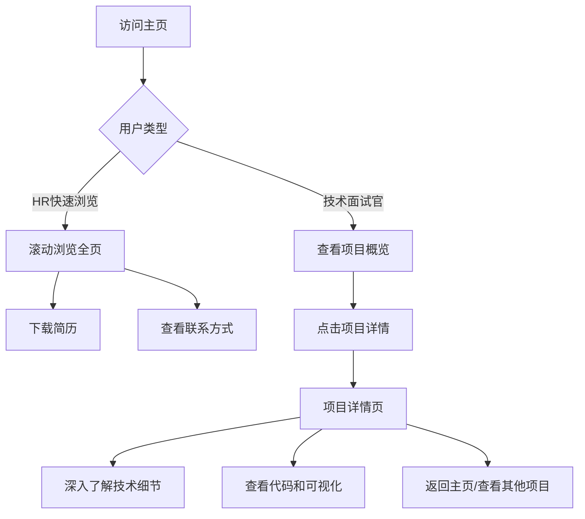
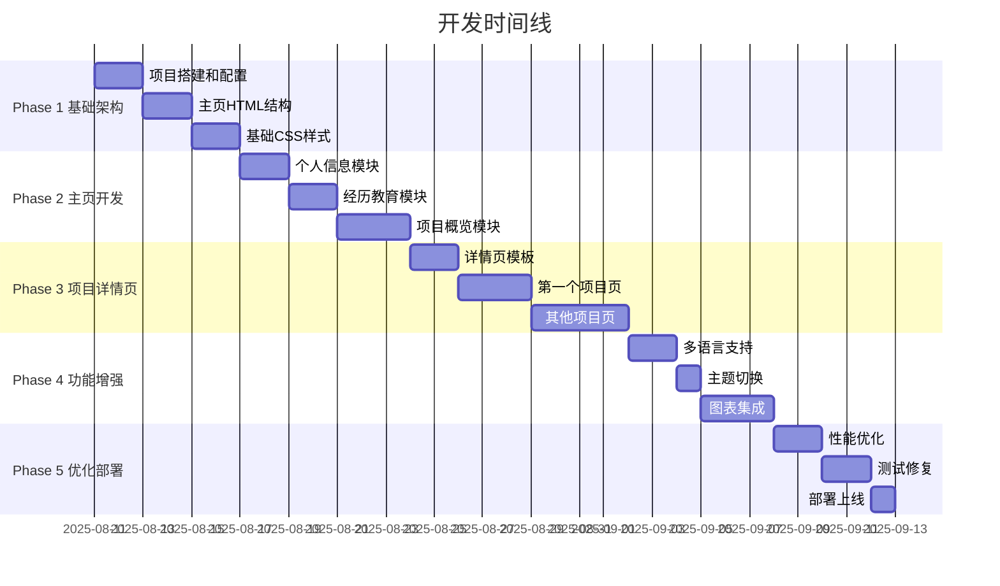

# 数据分析师个人作品集网站 PRD文档 v2.0

**版本：** v2.0（混合架构版）  
**日期：** 2025年1月  
**产品负责人：** [待填写]  
**目标上线日期：** 2025年8月11日

---

## 1. 产品概述

### 1.1 产品背景
作为数据分析师，需要一个专业的在线作品集网站来展示个人的专业能力、项目经验和技术实力。基于用户调研发现，HR需要快速浏览候选人概况，而技术面试官需要深入了解项目细节。因此采用混合架构，既满足快速浏览需求，又能展示项目深度。

### 1.2 产品定位
一个采用"主页概览+项目详情"混合架构的数据分析师作品集网站，主页展示个人全貌，独立页面深度展示数据分析项目，支持数据可视化、代码展示、多语言切换等特色功能。

### 1.3 目标用户

| 用户类型 | 需求特点 | 使用场景 |
|---------|---------|---------|
| **HR/招聘者** | 快速了解候选人背景 | 30秒-2分钟快速浏览 |
| **技术面试官** | 深入评估技术能力 | 5-15分钟详细查看项目 |
| **部门主管** | 了解业务影响力 | 3-5分钟查看项目成果 |
| **猎头** | 获取基本信息和联系方式 | 1-2分钟获取关键信息 |

### 1.4 核心价值
- **双层展示体系：** 主页快速概览 + 详情页深度展示
- **专业数据展示：** 交互式可视化 + 代码能力展示
- **灵活访问路径：** 支持快速浏览和深度探索两种模式
- **项目可分享性：** 每个项目有独立URL，便于定向分享

---

## 2. 产品目标与成功指标

### 2.1 产品目标

| 阶段 | 目标 | 关键结果 |
|------|------|---------|
| **短期（1个月）** | 网站上线 | - 完成5个核心页面开发<br>- 展示3个完整项目<br>- 部署到GitHub Pages |
| **中期（3个月）** | 获得认可 | - 获得20次有效查看<br>- 至少5次面试邀请<br>- 收集用户反馈优化 |
| **长期（6个月）** | 建立影响力 | - 月均访问100+<br>- 添加博客功能<br>- 迁移到独立域名 |

### 2.2 成功指标

| 指标类型 | 具体指标 | 目标值 |
|---------|---------|--------|
| **性能指标** | 主页加载时间 | < 2秒 |
| | 项目详情页加载时间 | < 3秒 |
| **用户体验** | 主页停留时间 | > 1分钟 |
| | 项目详情页停留时间 | > 3分钟 |
| | 跳出率 | < 40% |
| **转化指标** | 简历下载率 | > 15% |
| | 项目详情点击率 | > 30% |
| | 联系转化率 | > 5% |

---

## 3. 信息架构

### 3.1 网站结构图

```
portfolio/
│
├── 主页 (index.html) - 单页滚动式
│   ├── 导航栏（固定）
│   │   ├── Logo/名字
│   │   ├── 页内导航（关于/经历/项目/技能/联系）
│   │   ├── 语言切换（中/英）
│   │   └── 主题切换（深色/浅色）
│   │
│   ├── Hero区域
│   │   ├── 个人照片/头像
│   │   ├── 姓名 + 职位
│   │   ├── 一句话介绍
│   │   ├── 简历下载按钮
│   │   └── 社交媒体链接
│   │
│   ├── 关于我（#about）
│   │   ├── 个人简介
│   │   ├── 核心竞争力
│   │   └── 职业目标
│   │
│   ├── 工作经历（#experience）
│   │   └── 时间轴展示
│   │       ├── 公司信息
│   │       ├── 职位 + 时间
│   │       └── 关键成就
│   │
│   ├── 教育背景（#education）
│   │   ├── 学历信息
│   │   └── 专业认证
│   │
│   ├── 项目展示（#projects）
│   │   └── 项目卡片网格
│   │       ├── 项目标题
│   │       ├── 简短描述
│   │       ├── 技术标签
│   │       ├── 关键指标
│   │       ├── 预览图表
│   │       └── "查看详情"链接
│   │
│   ├── 技能矩阵（#skills）
│   │   ├── 技术技能
│   │   ├── 工具熟练度
│   │   └── 软技能
│   │
│   └── 联系方式（#contact）
│       ├── 联系表单
│       └── 其他联系方式
│
└── 项目详情页 (/projects/)
    ├── 销售预测模型 (sales-forecasting.html)
    ├── 客户细分分析 (customer-segmentation.html)
    ├── A/B测试分析 (ab-testing.html)
    └── [更多项目页面]
        │
        └── 每个项目详情页包含：
            ├── 返回导航
            ├── 项目标题
            ├── 执行摘要
            ├── 业务背景
            ├── 数据概览
            ├── 方法论
            ├── 详细分析过程
            ├── 代码展示
            ├── 交互式可视化
            ├── 结果与影响
            ├── 关键学习
            └── 相关项目推荐
```

### 3.2 页面流程图



---

## 4. 功能需求

### 4.1 主页功能模块

#### P0 - 核心功能（必须实现）

| 功能模块 | 功能描述 | 交互说明 | 验收标准 |
|---------|---------|---------|---------|
| **固定导航栏** | 页面滚动时保持可见 | 点击导航项平滑滚动到对应区域 | 导航准确，滚动流畅 |
| **Hero区域** | 第一印象展示 | 简历下载、社交链接可点击 | 信息完整，视觉吸引 |
| **个人简介** | 展示背景和价值主张 | 支持展开/收起长文本 | 内容清晰，重点突出 |
| **工作经历时间轴** | 可视化职业发展 | 悬停显示详细信息 | 时间线清晰，交互自然 |
| **项目卡片网格** | 3-5个核心项目概览 | 卡片悬停效果，点击进入详情 | 布局整齐，信息层次清晰 |
| **简历下载** | PDF格式简历 | 一键下载，支持中英文版本 | 下载成功率100% |
| **响应式布局** | 适配各种设备 | 断点：768px, 1024px, 1440px | 各设备显示正常 |

#### P1 - 重要功能（优先实现）

| 功能模块 | 功能描述 | 交互说明 | 验收标准 |
|---------|---------|---------|---------|
| **深色/浅色模式** | 主题切换 | 点击切换，状态保存到localStorage | 切换流畅，颜色协调 |
| **中英文切换** | 双语支持（URL路径区分） | 独立HTML文件，localStorage记录偏好 | 翻译准确，切换流畅 |
| **项目预览图表** | 简单数据可视化 | 主页展示静态或简单交互图表 | 图表清晰，加载快速 |
| **技能可视化** | 技能熟练度展示 | 使用雷达图或进度条 | 直观展示技能水平 |
| **滚动动画** | 元素渐入效果 | 滚动到可视区域时触发 | 动画流畅，不影响性能 |

#### P0 - 核心功能（必须实现）- 语言切换系统

| 功能模块 | 功能描述 | 技术实现 | 验收标准 |
|---------|---------|---------|----------|
| **URL路径语言区分** | 为每种语言创建独立HTML | 中文默认，英文添加-en后缀 | 所有页面有对应语言版本 |
| **语言偏好存储** | 记住用户语言选择 | localStorage持久化存储 | 刷新后保持语言选择 |
| **智能页面跳转** | 切换语言时自动跳转 | JS检测当前页面并跳转对应版本 | 切换流畅无404错误 |
| **链接自动适配** | 页面内链接语言一致 | 动态更新所有href属性 | 导航语言统一 |
| **内容动态渲染** | 从data.js读取对应语言内容 | ContentRenderer类处理 | 内容完整准确 |
| **浏览器语言检测** | 首次访问自动选择语言 | navigator.language检测 | 智能默认语言 |

### 4.2 项目详情页功能模块

#### P0 - 核心功能（必须实现）

| 功能模块 | 功能描述 | 技术实现 | 验收标准 |
|---------|---------|---------|---------|
| **项目导航** | 返回主页和项目间切换 | 固定头部导航条 | 导航清晰便捷 |
| **执行摘要** | 项目核心价值一览 | 突出显示关键成果 | 1分钟内理解项目价值 |
| **业务背景** | 详细问题描述 | 结构化文本展示 | 背景交代清楚 |
| **数据概览** | 数据集描述和统计 | 表格+可视化结合 | 数据特征清晰 |
| **方法论展示** | 分析方法和流程 | 流程图+文字说明 | 方法论清晰可复现 |
| **交互式图表** | 深度数据可视化 | Plotly.js实现 | 交互流畅，信息丰富 |
| **代码展示** | 关键代码片段 | Prism.js语法高亮 | 代码清晰，可复制 |
| **结果影响** | 业务影响量化展示 | 数据对比图表 | 成果量化明确 |

#### P1 - 重要功能（优先实现）

| 功能模块 | 功能描述 | 技术实现 | 验收标准 |
|---------|---------|---------|---------|
| **目录导航** | 页内章节快速跳转 | 侧边栏或浮动目录 | 长页面导航便利 |
| **代码运行结果** | 展示代码输出 | 预渲染的输出展示 | 代码和结果对应 |
| **图表下载** | 导出图表图片 | Plotly内置功能 | 支持PNG/SVG下载 |
| **相关项目推荐** | 引导查看其他项目 | 底部推荐卡片 | 增加项目浏览深度 |
| **分享功能** | 社交媒体分享 | 分享按钮+元数据 | 分享预览正确 |

### 4.3 数据结构设计

```javascript
// 主页数据结构 (data.js)
const portfolioData = {
    personal: {
        zh: {
            name: "姓名",
            title: "高级数据分析师",
            bio: "7年数据分析经验，专注于...",
            email: "email@example.com",
            linkedin: "linkedin.com/in/username",
            github: "github.com/username"
        },
        en: {
            name: "Name",
            title: "Senior Data Analyst",
            bio: "7 years of experience in...",
            // ...
        }
    },
    
    projects: [
        {
            id: "sales-forecasting",
            zh: {
                title: "销售预测模型",
                summary: "使用LSTM和ARIMA混合模型预测销售趋势",
                description: "为零售企业构建销售预测系统...",
                techStack: ["Python", "TensorFlow", "PostgreSQL"],
                metrics: {
                    accuracy: "94%",
                    improvement: "+23%",
                    dataVolume: "500万条"
                }
            },
            en: {
                title: "Sales Forecasting Model",
                // ...
            },
            previewChart: {
                type: "line",
                data: {} // 简化的图表数据
            },
            detailUrl: "projects/sales-forecasting.html",
            thumbnail: "assets/img/sales-forecast-thumb.png"
        }
    ],
    
    experience: [
        {
            zh: {
                company: "科技公司A",
                position: "高级数据分析师",
                period: "2022.01 - 至今",
                location: "上海",
                achievements: [
                    "建立公司数据分析体系，提升决策效率30%",
                    "主导营销效果归因模型，ROI提升25%"
                ]
            },
            en: {
                company: "Tech Company A",
                // ...
            }
        }
    ]
};

// 项目详情页数据结构
const projectDetail = {
    id: "sales-forecasting",
    zh: {
        title: "销售预测模型",
        subtitle: "基于深度学习的多维度销售预测系统",
        executiveSummary: {
            background: "公司面临库存管理和供应链优化挑战",
            solution: "构建LSTM+ARIMA混合预测模型",
            impact: "库存成本降低23%，缺货率降低45%"
        },
        sections: [
            {
                title: "业务背景",
                content: "详细的业务背景描述...",
                type: "text"
            },
            {
                title: "数据探索",
                content: {
                    description: "数据集包含3年的销售记录...",
                    stats: {
                        records: "500万条",
                        features: "45个",
                        timeRange: "2021-2024"
                    }
                },
                type: "data-overview"
            },
            {
                title: "建模过程",
                content: {
                    code: `
import pandas as pd
import numpy as np
from tensorflow.keras.models import Sequential
from tensorflow.keras.layers import LSTM, Dense

# 数据预处理
def prepare_data(df):
    # 特征工程
    df['rolling_mean'] = df['sales'].rolling(7).mean()
    df['rolling_std'] = df['sales'].rolling(7).std()
    return df

# LSTM模型构建
model = Sequential([
    LSTM(50, activation='relu', input_shape=(n_steps, n_features)),
    Dense(1)
])
                    `,
                    language: "python"
                },
                type: "code"
            },
            {
                title: "结果可视化",
                content: {
                    chartId: "forecast-results",
                    chartConfig: {
                        // Plotly配置
                    }
                },
                type: "visualization"
            }
        ]
    },
    en: {
        // 英文版本
    }
};
```

---

## 5. 非功能需求

### 5.1 性能需求

| 页面类型 | 性能指标 | 目标值 | 优化策略 |
|---------|---------|--------|---------|
| **主页** | 首屏加载时间 | < 2s | 图片懒加载、CDN加速 |
| | 完整加载时间 | < 4s | 代码分割、压缩 |
| **项目详情页** | 首屏加载时间 | < 2.5s | 按需加载图表库 |
| | 交互响应时间 | < 100ms | 防抖、节流优化 |
| **通用** | Lighthouse分数 | > 90 | 持续性能监控 |

### 5.2 兼容性需求

| 类型 | 要求 | 测试范围 |
|------|------|---------|
| **浏览器** | 最近2个版本 | Chrome, Firefox, Safari, Edge |
| **设备** | 响应式适配 | Desktop (1920/1440/1366)<br>Tablet (768/1024)<br>Mobile (375/414) |
| **网络** | 弱网可用 | 3G网络下可访问 |

### 5.3 SEO需求

| 页面 | SEO要求 | 实现方式 |
|------|---------|---------|
| **主页** | 完整的meta信息 | title, description, keywords |
| **项目详情页** | 独立的SEO信息 | 每个项目独立的meta标签 |
| **通用** | 结构化数据 | JSON-LD格式的个人信息 |
| | 社交分享优化 | Open Graph和Twitter Card |

---

## 6. 技术架构

### 6.1 技术栈

| 层级 | 技术选择 | 说明 |
|------|---------|------|
| **前端框架** | 纯静态 HTML/CSS/JS | 简单可靠，易于维护 |
| **CSS方案** | CSS Grid + Flexbox + 变量 | 现代布局，主题支持 |
| **数据可视化** | Plotly.js (主) + Chart.js (辅) | Plotly用于复杂交互，Chart.js用于简单图表 |
| **代码高亮** | Prism.js | 轻量级，多语言支持 |
| **动画** | CSS Animation + Intersection Observer | 原生实现，性能最优 |
| **构建工具** | 无（开发）/ 简单压缩（生产） | 降低复杂度 |
| **部署** | GitHub Pages + GitHub Actions | 自动化部署 |

### 6.2 实际文件结构（语言切换更新版）

```
portfolio/                                    # 项目根目录
├── index.html                               # ✅ 中文主页（已实现）
├── index-en.html                            # 🆕 英文主页（待实现）
├── contact.html                             # ✅ 中文联系页（已实现）
├── contact-en.html                          # 🆕 英文联系页（待实现）
├── projects/                                # 项目详情页目录
│   ├── _template.html                       # ✅ 项目页模板（已实现）
│   ├── Bank Customer Churn Prediction/     # 银行客户流失预测项目
│   │   ├── Bank Customer Churn Prediction.html       # ✅ 中文版
│   │   ├── Bank Customer Churn Prediction-en.html    # 🆕 英文版（待实现）
│   │   └── figures/                         # 项目图表资源（5张图）
│   ├── e-commerce fraud detection/         # 电商欺诈检测项目
│   │   ├── e-commerce fraud detection.html          # ✅ 中文版
│   │   ├── e-commerce fraud detection-en.html       # 🆕 英文版（待实现）
│   │   └── figures/                         # 项目图表资源（8张图）
│   └── lending hub loan prediction/        # 贷款违约预测项目
│       ├── lending hub loan prediction.html          # ✅ 中文版
│       ├── lending hub loan prediction-en.html       # 🆕 英文版（待实现）
│       └── figures/                         # 项目图表资源（15张图）
├── assets/
│   ├── css/                                 # CSS模块化架构
│   │   ├── README.md                        # ✅ CSS架构说明文档
│   │   ├── index.css                        # ✅ 主样式（全局变量+通用组件）
│   │   ├── project.css                      # ✅ 项目详情页专用样式
│   │   └── contact.css                      # ✅ 联系页面专用样式
│   ├── js/                                  # JavaScript模块化架构
│   │   ├── index.js                         # ✅ 主页核心逻辑（已实现）
│   │   ├── data.js                          # ✅ 作品集数据配置（双语数据）
│   │   ├── logo.js                          # ✅ Logo动画系统（已实现）
│   │   ├── contact.js                       # ✅ 联系页面功能（已实现）
│   │   ├── common.js                        # ✅ 通用工具和主题系统（已实现）
│   │   ├── project.js                       # ✅ 项目页面通用逻辑（已实现）
│   │   ├── charts.js                        # ✅ 图表管理器（已实现）
│   │   ├── language-switcher.js             # 🆕 语言切换核心模块（待实现）
│   │   └── content-renderer.js              # 🆕 内容渲染器（待实现）
│   ├── data/                                # 数据目录结构
│   │   └── projects/                        # 项目数据文件（空目录）
│   └── img/                                 # 图片资源
│       ├── profile/                         # 个人照片
│       │   └── avatar.jpg                   # ✅ 头像（已有）
│       └── projects/                        # 项目缩略图
│           ├── sales-forecast-thumb.png     # ✅ 预留缩略图（已有）
│           ├── customer-seg-thumb.png       # ✅ 预留缩略图（已有）
│           └── ab-test-thumb.png            # ✅ 预留缩略图（已有）
├── 肖炬晔简历.pdf                           # ✅ 中文简历（已有）
├── README.md                                # ✅ 项目说明（已有）
├── CLAUDE.md                                # ✅ Claude Code指导文档（已创建）
├── prd需求.md                               # ✅ 本PRD文档（当前文件）
└── 设计风格文档米色.md                      # ✅ 设计系统文档（已有）
```

### 6.3 数据架构实现状态

#### ✅ 已实现的数据结构

**主数据配置 (assets/js/data.js):**
```javascript
const portfolioData = {
    // 个人信息（中英双语结构已搭建）
    personal: { zh: {...}, en: {...} },
    
    // 关于我页面数据
    about: { zh: {...}, en: {...} },
    
    // 工作经历数据（时间轴格式）
    experience: [
        { zh: {...}, en: {...} },  // 支持多个工作经历
    ],
    
    // 教育背景数据
    education: [
        { zh: {...}, en: {...} },  // 支持多个教育经历
    ],
    
    // 项目展示数据（主页卡片）
    projects: [
        {
            id: "unique-project-id",
            zh: { title, summary, description, techStack, metrics },
            en: { title, summary, description, techStack, metrics },
            previewChart: { type, data },  // 预览图表配置
            detailUrl: "projects/project-name.html",
            thumbnail: "assets/img/projects/thumb.png"
        }
    ],
    
    // 技能矩阵数据
    skills: {
        technical: [{ name, level }],  // 技术技能
        tools: [{ name, level }],      // 工具熟练度  
        soft: [{ name, level }]        // 软技能
    },
    
    // 联系方式数据
    contact: { zh: {...}, en: {...} },
    
    // 导航菜单数据
    navigation: { zh: {...}, en: {...} }
};
```

#### ✅ 已实现的功能模块

**主题系统:**
- ✅ 深色/浅色模式切换
- ✅ localStorage状态持久化
- ✅ 系统主题检测
- ✅ 完整的CSS变量系统（米色设计系统）

**动画系统:**
- ✅ Logo"数据织者"动画（网格+织梭+字母显现）
- ✅ 滚动渐现动画（Intersection Observer）
- ✅ 数字计数动画
- ✅ 导航滚动监听（Scroll Spy）

**国际化系统:**
- ✅ i18n类实现（完整的翻译键值对）
- ✅ 双语数据结构支持
- ⚠️ 前端语言切换功能（部分实现）

**图表系统:**
- ✅ ChartManager类（支持Chart.js和Plotly.js）
- ✅ 主题适配（图表颜色随主题变化）
- ✅ 响应式图表支持

#### ❌ 尚未实现的数据结构

**项目详情页独立数据文件:**
```javascript
// 计划：assets/data/projects/{project-id}.js
// 实际：目前项目详情直接写在HTML中，未实现动态数据加载
const projectDetailData = {
    id: "project-id",
    zh: {
        title: "",
        subtitle: "",
        executiveSummary: { background, solution, impact },
        sections: [
            { title, content, type },  // 支持text, data-overview, code, visualization等类型
        ],
        charts: [
            { elementId, type, data, layout }  // Plotly图表配置
        ]
    },
    en: { /* 英文版本 */ }
};
```

#### ⚠️ 部分实现的功能

**联系表单:**
- ✅ 表单UI和验证
- ✅ mailto邮件客户端集成  
- ❌ 后端表单处理（计划中）

**简历下载:**
- ✅ 中文简历文件存在
- ❌ 英文简历文件
- ❌ 下载按钮功能集成

### 6.3 核心代码示例

**路由和导航管理：**
```javascript
// main.js - 主页导航管理
class Navigation {
    constructor() {
        this.initSmoothScroll();
        this.initScrollSpy();
        this.initMobileMenu();
    }
    
    initSmoothScroll() {
        document.querySelectorAll('a[href^="#"]').forEach(anchor => {
            anchor.addEventListener('click', (e) => {
                e.preventDefault();
                const target = document.querySelector(anchor.getAttribute('href'));
                target.scrollIntoView({ behavior: 'smooth', block: 'start' });
            });
        });
    }
    
    initScrollSpy() {
        const sections = document.querySelectorAll('section[id]');
        const navLinks = document.querySelectorAll('.nav-link');
        
        const observer = new IntersectionObserver((entries) => {
            entries.forEach(entry => {
                if (entry.isIntersecting) {
                    navLinks.forEach(link => {
                        link.classList.toggle('active', 
                            link.getAttribute('href') === `#${entry.target.id}`
                        );
                    });
                }
            });
        }, { threshold: 0.5 });
        
        sections.forEach(section => observer.observe(section));
    }
}
```

**项目详情页数据加载：**
```javascript
// project-common.js - 项目详情页通用逻辑
class ProjectDetail {
    constructor(projectId) {
        this.projectId = projectId;
        this.lang = localStorage.getItem('language') || 'zh';
        this.loadProjectData();
    }
    
    async loadProjectData() {
        try {
            // 动态加载项目数据
            const script = document.createElement('script');
            script.src = `../assets/data/projects/${this.projectId}.js`;
            document.head.appendChild(script);
            
            script.onload = () => {
                this.renderProject(window[`${this.projectId}Data`]);
            };
        } catch (error) {
            console.error('Failed to load project data:', error);
        }
    }
    
    renderProject(data) {
        const content = data[this.lang];
        
        // 渲染标题
        document.getElementById('project-title').textContent = content.title;
        
        // 渲染各个部分
        content.sections.forEach(section => {
            this.renderSection(section);
        });
        
        // 初始化图表
        this.initCharts(content.charts);
        
        // 代码高亮
        Prism.highlightAll();
    }
    
    initCharts(charts) {
        charts.forEach(chart => {
            if (chart.type === 'plotly') {
                Plotly.newPlot(chart.elementId, chart.data, chart.layout, {responsive: true});
            }
        });
    }
}
```

**联系页面功能实现：**
```javascript
// contact.js - 联系页面专用JavaScript文件
// 主要功能包括：
// 1. Lucide图标激活
// 2. 导航栏滚动效果
// 3. 滚动渐现动画
// 4. 主题切换功能
// 5. 语言切换功能（待实现）
// 6. 联系表单处理

// 联系表单处理核心逻辑
const contactCardForm = document.querySelector('.contact-card-simple form');
if (contactCardForm) {
    contactCardForm.addEventListener('submit', (e) => {
        e.preventDefault();
        
        // 获取表单数据
        const formData = new FormData(contactCardForm);
        const name = formData.get('name');
        const email = formData.get('email');
        const message = formData.get('message');
        
        // 构建邮件链接
        const subject = '来自作品集网站的消息';
        const emailBody = `姓名: ${name}\n邮箱: ${email}\n\n消息内容:\n${message}`;
        const mailtoLink = `mailto:jx2479@columbia.edu?subject=${encodeURIComponent(subject)}&body=${encodeURIComponent(emailBody)}`;
        
        // 打开邮件客户端
        window.location.href = mailtoLink;
        
        // 显示成功消息
        alert('邮件客户端已打开，请发送邮件。');
    });
}
```

**动画Logo实现：**
```javascript
// logo.js - 动画Logo专用JavaScript文件
// 实现"数据织者"概念的品牌Logo动画

class LogoAnimation {
    constructor() {
        this.weaverLine = null;
        this.logoLetters = null;
        this.isAnimating = false;
        this.init();
    }

    // 播放完整动画序列
    playAnimation() {
        if (this.isAnimating) return;
        this.isAnimating = true;

        // 重置动画状态
        this.weaverLine.classList.remove('animate');
        this.logoLetters.classList.remove('animate');
        
        // 经线入绪（0-0.7秒）：数据网格线依次淡入并开始流动
        this.showStatus('1. 经线入绪 - 数据网格构建中...');
        
        // 纬线穿梭（0.8-2.3秒）：珊瑚色织梭线穿过
        setTimeout(() => {
            this.showStatus('2. 纬线穿梭 - 数据编织中...');
            this.weaverLine.classList.add('animate');
        }, 800);
        
        // 图样显现（1.8-2.8秒）：JX字母旋转缩放显现
        setTimeout(() => {
            this.showStatus('3. 图样显现 - JX浮现...');
            this.logoLetters.classList.add('animate');
        }, 1800);
        
        setTimeout(() => {
            this.showStatus('✨ 动画完成！悬停查看签名');
            this.isAnimating = false;
        }, 2800);
    }
}

// Logo设计理念：
// - 数据网格：代表数据结构和分析框架
// - 织梭穿梭：象征数据编织和模式识别  
// - JX显现：最终形成个人标识
// - 悬停展开：提供更多个人信息
```

**Logo动画样式实现：**
```css
/* Logo容器和基础样式 */
.navbar-logo {
    display: inline-flex;
    align-items: center;
    height: 40px;
    cursor: pointer;
    position: relative;
    padding: 0 12px;
    border-radius: 8px;
    transition: all var(--duration-normal);
}

/* 数据网格动画 */
.grid-line-v, .grid-line-h {
    stroke: var(--tan);
    stroke-width: 1;
    stroke-dasharray: 2 4;
    opacity: 0;
    animation: gridLineAppear 0.5s ease-out forwards, 
               gridFlow 8s linear infinite;
}

/* 织梭动画 */
.weaver-line {
    stroke: var(--coral);
    stroke-width: 2;
    stroke-linecap: round;
    opacity: 0;
    stroke-dasharray: 60;
    stroke-dashoffset: 60;
}

.weaver-line.animate {
    animation: weaveAnimation 2.5s ease-in-out forwards;
}

/* JX字母动画 */
.logo-letters {
    fill: var(--dark);
    font-family: var(--font-primary);
    font-weight: 700;
    font-size: 24px;
    opacity: 0;
    transform: scale(0.8);
}

.logo-letters.animate {
    animation: letterReveal 1s ease-out forwards;
    animation-delay: 0.8s;
}

/* 悬停签名效果 */
.logo-name {
    margin-left: 12px;
    overflow: hidden;
    width: 0;
    opacity: 0;
    white-space: nowrap;
    transition: width var(--duration-slow) var(--ease-out), 
                opacity var(--duration-slow) var(--ease-out);
}

.navbar-logo:hover .logo-name {
    width: 120px;
    opacity: 1;
}
```

---

## 7. 设计规范
根据设计风格文档

---

## 8. 开发计划

### 8.1 开发阶段划分



### 8.2 详细任务分解

#### Phase 1: 基础架构（第1周）- ✅ 已完成
- [X] 创建项目目录结构
- [X] 搭建基础HTML模板
- [X] 实现CSS变量系统（米色设计系统）
- [X] 配置响应式布局框架
- [X] 实现主题切换基础功能
- [X] 创建contact联系页面
- [X] 实现动画Logo系统（数据织者动画）
- [X] 创建CSS模块化架构（index.css + project.css + contact.css）
- [X] 建立JavaScript模块化结构

#### Phase 2: 主页开发（第2周）- ✅ 已完成
- [X] Hero区域实现（个人介绍+数据指标）
- [X] 导航栏和滚动监听（Scroll Spy）
- [X] 个人简介区域（关于我）
- [X] 工作经历时间轴（Code Auto Tools + China United Transportation）
- [X] 教育背景展示（哥伦比亚大学+密歇根大学）
- [X] 项目卡片网格布局（Bento Box设计）
- [X] 技能矩阵可视化（技能卡片）
- [X] 联系方式导航（跳转到contact.html）
- [X] 滚动渐现动画（Intersection Observer）
- [X] 数字计数动画

#### Phase 3: 项目详情页（第3周）- ✅ 已完成
- [X] 创建项目详情页模板（_template.html）
- [X] 第一个完整项目页面（银行客户流失预测）
- [X] 第二个完整项目页面（电商欺诈检测）
- [X] 第三个完整项目页面（贷款违约预测）
- [X] 代码展示和高亮（Prism.js集成）
- [X] 项目页面导航和目录系统
- [X] 项目页面样式系统（project.css）
- [X] 项目图表展示（28张专业数据可视化图表）
- [⚠️] 项目数据加载机制（计划中的动态加载未实现）
- [⚠️] 交互式图表集成（Plotly.js已引入但交互功能待实现）

#### Phase 4: 功能增强（第4周）- 语言切换重新实现
- [X] 完善主题切换（深色模式支持）
- [X] 集成图表库（Plotly.js + Chart.js支持）
- [X] 动画效果完善（Logo+滚动+数字计数）
- [X] 联系表单功能（mailto集成）
- [X] SEO基础优化（meta标签）
- [ ] 创建语言切换模块（language-switcher.js）
- [ ] 实现内容渲染器（content-renderer.js）
- [ ] 创建所有页面的英文版本
- [ ] 实现智能链接适配
- [ ] 测试语言切换功能
- [ ] 优化切换体验
- [❌] 简历下载功能（按钮未连接）

#### Phase 5: 优化部署（第5周）- ❌ 待实现
- [ ] 性能优化（压缩、懒加载）
- [ ] 跨浏览器测试
- [ ] 移动端深度优化
- [ ] 配置GitHub Actions自动部署
- [ ] 部署到GitHub Pages
- [ ] 完善使用文档

### 8.3 当前开发状态总结

**✅ 已完成的核心功能（约80%）:**
1. **基础架构**: 完整的设计系统、模块化CSS/JS、响应式布局
2. **主页功能**: 所有区块已实现，包括Hero、关于、经历、教育、项目展示、技能
3. **动画系统**: Logo动画、滚动效果、主题切换动画
4. **联系页面**: 完整的联系表单和信息展示
5. **项目展示**: 3个完整的项目详情页（银行客户流失、电商欺诈检测、贷款违约预测）
6. **数据可视化**: 28张专业的数据分析图表展示
7. **代码展示**: 完整的代码高亮和展示系统

**⚠️ 部分完成的功能（约15%）:**
1. **国际化**: 数据结构支持双语，但前端切换功能未完整实现
2. **项目数据**: 主页展示已实现，但详情页动态数据加载未实现
3. **图表系统**: 静态图表展示完成，交互式图表待实现

**❌ 待实现的功能（约5%）:**
1. **简历下载**: 下载按钮功能集成
2. **语言切换**: 前端UI实现
3. **部署优化**: GitHub Actions、性能优化
4. **交互式图表**: 项目详情页的Plotly.js动态图表

---

## 9. 测试计划

### 9.1 测试清单

| 测试类型 | 测试项 | 验收标准 |
|---------|--------|---------|
| **功能测试** | | |
| 导航功能 | 所有导航链接 | 跳转正确，滚动平滑 |
| 项目详情 | 项目页面加载 | 数据完整，图表正常 |
| 下载功能 | 简历下载 | 中英文版本都可下载 |
| 语言切换 | 全站语言切换 | 所有文本正确切换 |
| 主题切换 | 深浅色切换 | 颜色方案正确，状态保存 |
| 联系表单 | 表单提交和邮件功能 | 表单验证正确，邮件客户端正常打开 |
| **性能测试** | | |
| 加载速度 | 主页加载 | < 2秒 |
| | 项目页加载 | < 3秒 |
| 交互响应 | 用户操作响应 | < 100ms |
| **兼容性测试** | | |
| 浏览器 | Chrome/Firefox/Safari/Edge | 显示和功能正常 |
| 设备 | Desktop/Tablet/Mobile | 响应式布局正确 |
| **可用性测试** | | |
| 信息架构 | 内容查找 | 3次点击内找到 |
| 可读性 | 文字内容 | 清晰易读 |
| 交互反馈 | 操作反馈 | 有明确的视觉反馈 |

### 9.2 测试用例示例

#### 9.2.1 语言切换功能测试

```javascript
// 测试用例：语言切换功能
describe('语言切换功能测试', () => {
    test('语言切换按钮功能', async () => {
        // 1. 访问中文主页
        await page.goto('/index.html');
        
        // 2. 点击语言切换按钮
        await page.click('#lang-toggle');
        
        // 3. 验证跳转到英文版
        expect(page.url()).toBe('/index-en.html');
        
        // 4. 验证localStorage保存
        const lang = await page.evaluate(() => localStorage.getItem('language'));
        expect(lang).toBe('en');
    });
    
    test('语言偏好持久化', async () => {
        // 1. 设置英文偏好
        await page.evaluate(() => localStorage.setItem('language', 'en'));
        
        // 2. 访问中文页面
        await page.goto('/index.html');
        
        // 3. 验证自动重定向到英文版
        expect(page.url()).toBe('/index-en.html');
    });
    
    test('跨页面语言一致性', async () => {
        // 1. 在英文主页点击项目
        await page.goto('/index-en.html');
        await page.click('.project-card[data-project="bank-churn"]');
        
        // 2. 验证跳转到英文项目页
        expect(page.url()).toContain('Bank Customer Churn Prediction-en.html');
        
        // 3. 点击导航返回主页
        await page.click('a[href="../index-en.html"]');
        
        // 4. 验证保持英文版本
        expect(page.url()).toBe('/index-en.html');
    });
});
```

#### 9.2.2 内容渲染测试

```javascript
// 测试用例：动态内容渲染
describe('内容渲染测试', () => {
    test('中文内容完整性', async () => {
        await page.goto('/index.html');
        
        // 验证个人信息
        const name = await page.$eval('.hero-name', el => el.textContent);
        expect(name).toBe('肖炬晔');
        
        // 验证工作经历
        const jobTitle = await page.$eval('.job-title', el => el.textContent);
        expect(jobTitle).toContain('数据分析师');
        
        // 验证项目标题
        const projectTitle = await page.$eval('.project-title', el => el.textContent);
        expect(projectTitle).toContain('银行客户流失预测');
    });
    
    test('英文内容完整性', async () => {
        await page.goto('/index-en.html');
        
        // 验证个人信息
        const name = await page.$eval('.hero-name', el => el.textContent);
        expect(name).toBe('Juye Xiao');
        
        // 验证工作经历
        const jobTitle = await page.$eval('.job-title', el => el.textContent);
        expect(jobTitle).toContain('Data Analyst');
        
        // 验证项目标题
        const projectTitle = await page.$eval('.project-title', el => el.textContent);
        expect(projectTitle).toContain('Bank Customer Churn Prediction');
    });
});
```

#### 9.2.3 项目详情页测试

```javascript
// 测试用例：项目详情页加载
describe('项目详情页功能测试', () => {
    test('页面加载完整性', async () => {
        // 1. 访问项目详情页
        await page.goto('/projects/sales-forecasting.html');
        
        // 2. 检查核心元素存在
        expect(await page.$('#project-title')).toBeTruthy();
        expect(await page.$('.executive-summary')).toBeTruthy();
        expect(await page.$('.project-content')).toBeTruthy();
        
        // 3. 检查图表加载
        const charts = await page.$$('.plotly-chart');
        expect(charts.length).toBeGreaterThan(0);
        
        // 4. 检查目录导航
        const tocLinks = await page.$$('.toc-link');
        expect(tocLinks.length).toBeGreaterThan(0);
    });
});
```

### 9.3 手动测试流程

#### 9.3.1 语言切换手动测试

1. **初始访问测试**
   - 清空浏览器缓存和localStorage
   - 访问 index.html
   - 验证显示中文内容
   - 点击语言切换按钮
   - 验证跳转到 index-en.html
   - 验证显示英文内容

2. **语言偏好记忆测试**
   - 在英文页面刷新浏览器
   - 验证仍保持英文版本
   - 访问其他页面（如联系页）
   - 验证自动显示英文版本

3. **跨页面一致性测试**
   - 在英文主页点击项目卡片
   - 验证打开英文项目详情页
   - 点击导航栏链接
   - 验证所有链接指向英文页面

#### 9.3.2 响应式布局测试

1. **桌面端测试** (1920px, 1440px, 1366px)
   - 验证12列网格布局正确
   - 验证导航栏固定显示
   - 验证项目卡片3列显示

2. **平板端测试** (768px, 1024px)
   - 验证导航栏折叠菜单
   - 验证项目卡片2列显示
   - 验证字体大小适配

3. **移动端测试** (375px, 414px)
   - 验证单列布局
   - 验证触摸交互正常
   - 验证文字可读性

#### 9.3.3 性能测试

1. **加载性能**
   ```bash
   # 使用Lighthouse测试
   lighthouse http://localhost:8000 --view
   ```
   - 目标：性能分数 > 90
   - 目标：首次内容绘制 < 1.5s
   - 目标：可交互时间 < 3s

2. **运行时性能**
   - 打开Chrome DevTools Performance面板
   - 记录页面滚动和交互
   - 验证帧率 > 30fps
   - 验证无内存泄漏

### 9.4 测试数据准备

```javascript
// 测试数据配置
const testData = {
    // 中文测试数据
    zh: {
        personal: {
            name: "肖炬晔",
            title: "数据分析师",
            email: "jx2479@columbia.edu"
        },
        projects: [
            {
                title: "银行客户流失预测",
                description: "使用机器学习预测客户流失"
            }
        ]
    },
    // 英文测试数据
    en: {
        personal: {
            name: "Juye Xiao",
            title: "Data Analyst",
            email: "jx2479@columbia.edu"
        },
        projects: [
            {
                title: "Bank Customer Churn Prediction",
                description: "Predict customer churn using machine learning"
            }
        ]
    }
};
```

---

## 10. 风险管理

### 10.1 风险评估矩阵

| 风险项 | 概率 | 影响 | 风险等级 | 缓解措施 |
|--------|------|------|---------|---------|
| **技术风险** | | | | |
| Plotly.js文件过大影响加载 | 高 | 中 | 高 | CDN加载 + 按需引入 |
| 项目页面数据管理混乱 | 中 | 高 | 高 | 统一数据格式和加载机制 |
| 浏览器兼容性问题 | 中 | 中 | 中 | 充分测试 + Polyfill |
| **内容风险** | | | | |
| 项目数据准备不足 | 高 | 高 | 高 | 提前准备，分阶段完善 |
| 翻译质量问题 | 中 | 低 | 低 | 专业校对 |
| **运维风险** | | | | |
| GitHub Pages限制 | 低 | 高 | 中 | 准备备选部署方案 |
| 更新维护困难 | 中 | 中 | 中 | 良好的文档和代码结构 |

### 10.2 应急预案

1. **性能问题应急**
   - 方案A：关闭部分动画效果
   - 方案B：减少图表复杂度
   - 方案C：启用更激进的缓存策略

2. **部署问题应急**
   - 方案A：Netlify免费托管
   - 方案B：Vercel部署
   - 方案C：传统虚拟主机

---

## 11. 维护计划

### 11.1 日常维护

| 维护项 | 频率 | 具体内容 |
|--------|------|---------|
| **内容更新** | 按需 | 添加新项目、更新经历 |
| **数据备份** | 每月 | 备份所有数据文件 |
| **性能监控** | 每月 | 检查加载速度和错误 |
| **依赖更新** | 每季度 | 更新CDN链接版本 |
| **安全检查** | 每季度 | 检查潜在安全问题 |

### 11.2 更新流程

```bash
# 1. 更新项目内容
## 编辑 assets/data/projects/new-project.js
## 创建 projects/new-project.html

# 2. 更新主页
## 编辑 assets/js/data.js 添加项目卡片

# 3. 测试
## 本地测试所有功能
## 检查响应式布局

# 4. 部署
git add .
git commit -m "Add new project: [项目名称]"
git push origin main
## GitHub Actions 自动部署
```

### 11.3 版本迭代规划

| 版本 | 时间 | 主要特性 |
|------|------|---------|
| v1.0 | 当前 | 基础版本，混合架构 |
| v1.1 | +2月 | 添加博客功能 |
| v1.2 | +4月 | 项目筛选和搜索 |
| v2.0 | +6月 | React重构（可选） |
| v2.1 | +8月 | CMS后台管理 |

---

## 12. 成功标准

### 12.1 短期成功标准（1个月：2025年8月11日 - 2025年9月11日）
- ✅ 网站成功上线并可访问
- ✅ 展示至少3个完整的数据分析项目
- ✅ 移动端和桌面端都能正常访问
- ✅ 页面加载时间符合性能要求
- ✅ 获得至少5个同行的正面反馈

### 12.2 中期成功标准（3个月：2025年8月11日 - 2025年11月11日）
- ✅ 累计获得50+独立访问者
- ✅ 收到至少3次面试邀请
- ✅ 项目详情页平均停留时间>3分钟
- ✅ 至少1个项目被分享到社交媒体
- ✅ 建立个人品牌识别度

### 12.3 长期成功标准（6个月：2025年8月11日 - 2026年2月11日）
- ✅ 成为行业内认可的作品集范例
- ✅ 通过网站获得理想工作机会
- ✅ 月均访问量稳定在100+
- ✅ 激励其他数据分析师建立类似网站
- ✅ 形成持续更新和改进的机制

---

## 附录

### A. 参考资源
- [GitHub Pages文档](https://docs.github.com/pages)
- [Plotly.js官方文档](https://plotly.com/javascript/)
- [Web性能优化最佳实践](https://web.dev/performance/)
- [数据可视化设计原则](https://www.tableau.com/learn/articles/data-visualization)

### B. 术语表
| 术语 | 解释 |
|------|------|
| SPA | Single Page Application，单页应用 |
| MPA | Multi Page Application，多页应用 |
| CDN | Content Delivery Network，内容分发网络 |
| SEO | Search Engine Optimization，搜索引擎优化 |
| i18n | Internationalization，国际化 |

### C. 联系信息
- 产品负责人：[待填写]
- 技术支持：[待填写]
- 设计支持：[待填写]

---

**文档版本历史**

| 版本 | 日期 | 修改内容 | 作者 |
|------|------|---------|------|
| v1.0 | 2025.01 | 初始版本（单页架构） | - |
| v2.0 | 2025.01 | 改为混合架构方案 | - |
| v2.1 | 2025.01 | 更新实际实现状态和数据结构 | Claude Code |

**v2.1 更新说明:**
- ✅ 添加了实际文件结构和实现状态标记
- ✅ 详细说明了已实现vs计划的数据架构差异
- ✅ 更新了开发阶段完成情况（约70%完成度）
- ✅ 明确了当前项目的技术栈和功能模块状态
- ✅ 指出了待实现的核心功能和优化项

**v2.2 更新说明（2025.01）:**
- ✅ 更新项目完成度从70%到80%
- ✅ 添加了2个新完成的项目页面（电商欺诈检测、贷款违约预测）
- ✅ 更新了文件结构，反映3个完整的项目页面
- ✅ 记录了28张数据可视化图表的实现
- ✅ 调整了功能完成比例（80%/15%/5%）

---

**文档批准**

| 角色 | 姓名 | 签字 | 日期 |
|------|------|------|------|
| 产品负责人 | | | |
| 技术负责人 | | | |
| 项目发起人 | | | |